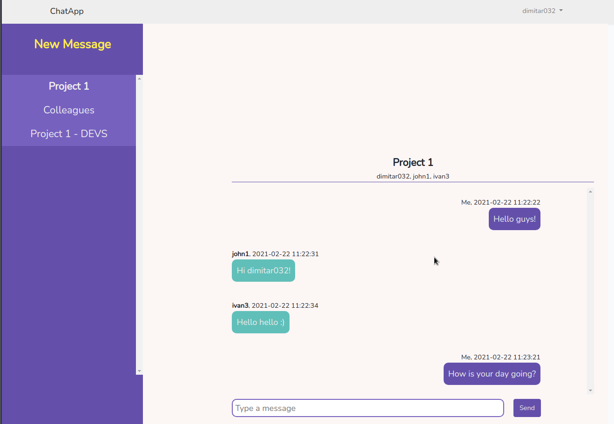

# Description
This Chat Application allows registered users to leave messages to other registered users.


# Main functionality:
- Registration page
- Login page
- Messages page for each user, where messages left by other users can be seen, replied
- Ability to add new messages
- Ability to send messages to groups
- Ability to send messages to users of offline group who receive them when they are online again

# Used technolgies
- PHP7.4
- Laravel 7
- Vue2
- SASS

# System Requirements
- MySQL8.0+
- PHP7.4+
- NodeJS v10+

# Projects installation
- Clone GitHub repo for this project locally
```bash
git clone git@github.com:dimitar032/chat_app.git
```

- Open newly folder
```bash
cd chat_app
```

- Install all PHP Dependencies via composer
```bash
composer install
```

- Install all JS Dependencies via npm
```bash
npm install
```

- Create a copy of your .env file
```bash
cp .env.example .env
```

- Generate an app encryption key
```bash
php artisan key:generate
```

- Create an empty database for our application
- In the .env file, add database information to allow Laravel to connect to the database
```env
DB_DATABASE=chat_app
DB_USERNAME=ENTER-USER-NAME
DB_PASSWORD=ENTER-PASSWORD
```
- Migrate the database
```bash
php artisan migrate
```

- Build the front-end
```bash
npm run prod
```

## Optionals for demo and test

#### Build a php demo/test server
```bash
php artisan serve
```

#### Debug
```
npm run dev
```

# Future Features to add/improve

## Add
- Messages in real-time
- Add internationalization
- Ability to rename an existing chat room
- Ability to add remove users from an existing chat room
- Ability to include the existing history to the newly added user to chat
- Ability to add a user in an existing chat room with other users
- Lazy loading of chat messages 
- Ability to edit chat messages
- Ability to know when a user sees a chat message
- Ability user to quote a chat message
- Ability to delete a chat message

## Improve
- More flexible search mechanism when adding users for creating a new chat room 
- Ability to recognize a link in a chat message
- Add tooltips for better UX (example: when covering the time of the chat message to display full date-time)